  <h1>Iván Mejía / Nuz</h1>
  

    Passionate about speed, code, and creativity. I blend the adrenaline of rally racing
    with the logic of programming to build unique digital experiences.
  

## About Me

I enjoy the world of **rally**, where precision, control, and speed define everything.
That same mindset drives how I approach coding — fast, efficient, and always improving.
I thrive on challenges that demand sharp thinking and clean execution, whether behind a wheel or a keyboard.

---

## Projects

**Game Finder** — A project focused on helping users discover games easily and efficiently.
Built with a clean UI and a fast backend to deliver a smooth experience from search to result.
Always exploring new ideas and pushing user experience further.

---

## Tech Stack

  

  

  

 

---

## Anime Vibes

Fan of dark and intense anime like **Hellsing**.
I gravitate toward stories with powerful characters, heavy atmosphere, and uncompromising aesthetics —
the kind that leave a mark long after the credits roll.

---

## Connect

  
  
  
  

  <i>"Code like you drive: fast, precise, and always in control."</i>

  

